# **\[fx-ES PLUS Series -2nd edition-\]fx-115ES PLUS 2nd & fx-991ZA PLUS II简评**

>若网页中图片无法正常显示，请检查当前网络环境能否正常访问GitHub。

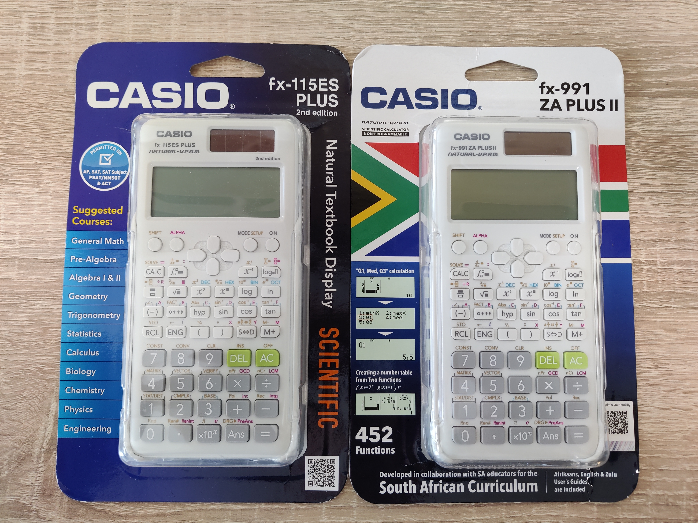

## 阅读须知
1.  除非另有声明，本文的文字、图片等均为本人创作及拍摄，未经许可不得以任何形式对本文的全部或部分内容进行转载、复制、改编、发布至其他平台等。
2. 文中的信息均基于发帖日期所能获取到的最新信息，当读者阅读时信息可能已有变化，一切均以最新消息为准。
3. 文中对计算器的描述等均属本人的主观感受，部分表述可能不够准确，若有疑惑欢迎指出。
4. 除非另有提及，否则文中出现的所有实际产品均为本人自费购买，本文不构成任何购买建议。
>注：部分阅读须知内容来自[@喜羊羊第x代](https://tieba.baidu.com/home/main?id=tb.1.2062eec0.FwWcq4rwt0_gRZlb9o1EWA)

## 写在前面
感谢[@喜羊羊第x代](https://tieba.baidu.com/home/main?id=tb.1.2062eec0.FwWcq4rwt0_gRZlb9o1EWA)和[@pyridinephenol](https://tieba.baidu.com/home/main/?id=tb.1.96303922.8s1lnkVa10MeKccPfcpLLA)对本文的补充以及存在错误的指正！

在2019年开始陆续更新上市的fx-ES PLUS Series -2nd edition-系列中，只有南非的fx-82ZA PLUS II以及fx-991ZA PLUS II相对于原ES PLUS型号有所升级；而在这个系列的旗舰型号中，又仅仅只有fx-991ZA PLUS II和fx-115ES PLUS 2nd edition的颜色为白色，其他的旗舰型号只有黑色~~（好丑）~~。

于是我在成功买到越南型号后萌生了购买这两款机型的想法，fx-115ES PLUS 2nd edition在淘宝和亚马逊全球购均能很方便的购买，于是我便开始了漫长的寻找南非代购的路程。不管怎么说，买到了.jpg

~~别问花费了多少，问就是心痛.jpg~~

而fx-ES PLUS的原型号fx-991ZA PLUS实在是没啥吸引力就不浪费钱买了（

本文还会出现fx-115ES PLUS等型号的计算器作为对比。

## 简要介绍
正如2nd edition的意思一样，fx-115ES PLUS 2nd edition是fx-115ES PLUS的更新型号。而另一款型号fx-991ZA PLUS II却产生了特例，并非单纯换壳更新，对比fx-991ZA PLUS增加了部分功能（fx-82ZA PLUS II也是如此）。

根据维基百科的说明，在1925年前南非的官方语言一直是荷兰语(Dutch)，南非(South Africa)在荷兰语中是Zuid-Afrika，这也便是ZA的由来， 在ISO 3166中，也是规定了ZA为南非的Alpha-2 code。

鉴于贴吧内已有@喜羊羊第x代对fx-115ES PLUS 2nd edition的[相关简略评测](https://tieba.baidu.com/p/7591156428)，本文将不会再对两机型中fx-115ES PLUS 2nd edition已存在的功能做过多评测。

下方图片为fx-ES PLUS 2nd edition的全部型号（应该是全部）（部分信息来源：[fx-ES PLUS Emulator Subscription](https://edu.casio.com/products/classroom/es_plus/)）
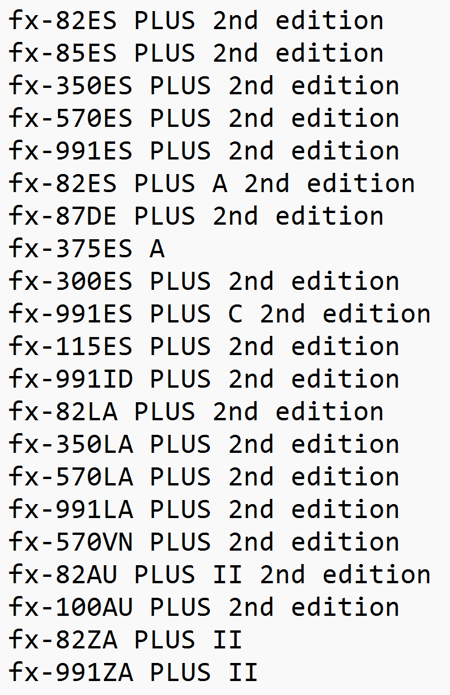

## 包装与外观
如图所示，两者均使用塑封包装，拆开之后便无法复原。
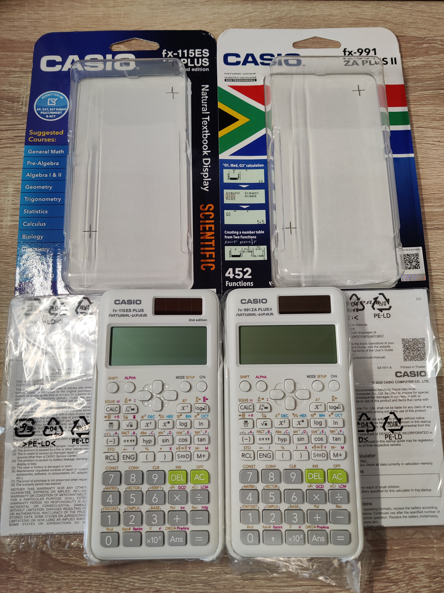

两者均为泰国制造生产。

保护壳外专门套了一层塑料膜，猜测是为了防止运输振动磨损卡扣。
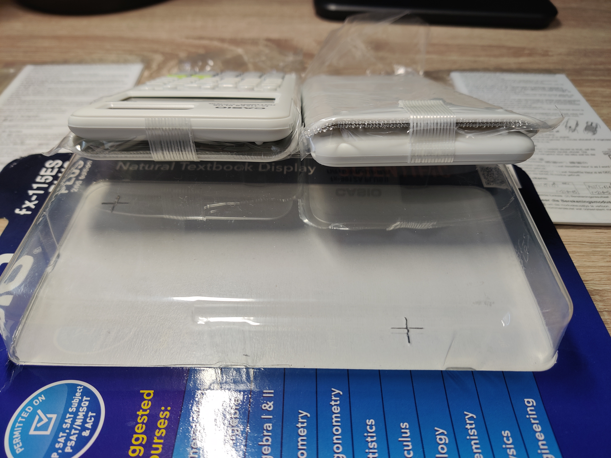

### 正面
很显然，升级后的fx-991ZA PLUS II使用了逗号(comma)作为小数分隔符，而在原型号fx-991ZA PLUS使用的是点号(decimal point)，后文还会提及并说明原因。

保护壳上的贴纸沿用了fx-ES PLUS的设计，并根据计算器的颜色将背景改为了白色。

虽说为泰国制造，但其印刷质量对比以前已经有了改进。
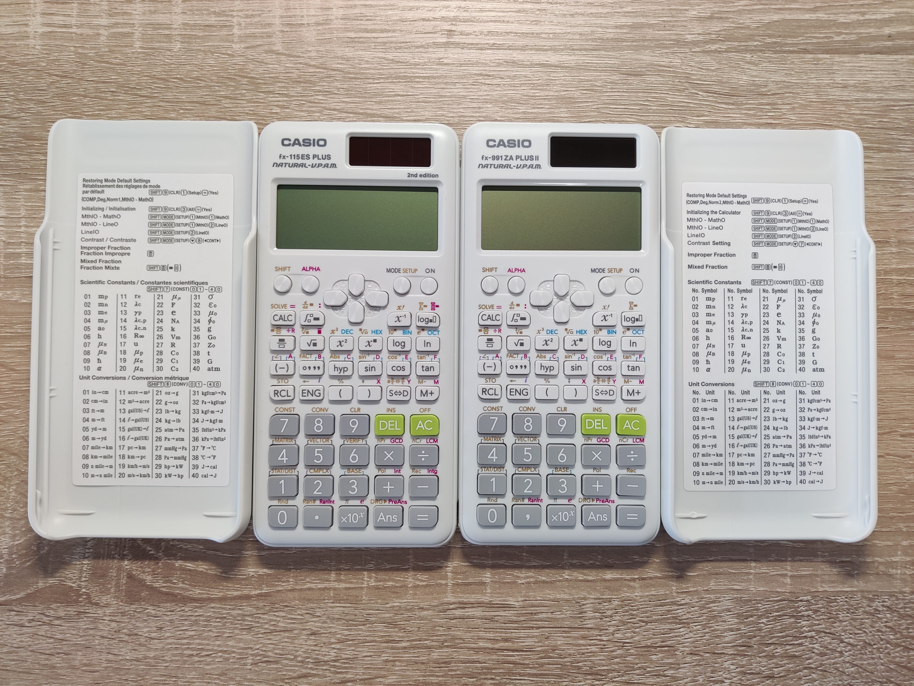

### 背面
可以看到带太阳能的fx-ES PLUS Series -2nd edition-系列型号计算器并没有对电池仓设计开孔和盖子。
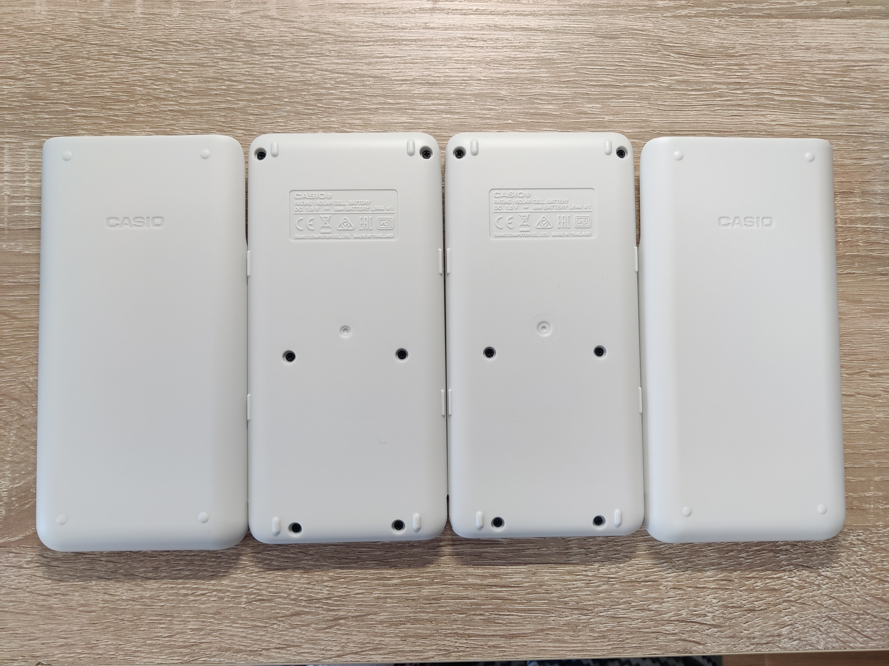

### 入门说明(Startup Guide)
从2019年开始的卡西欧大部分计算器生产线都仅附带了简要的入门说明来取代了原有的说明书~~（什么，环保.jpg）~~，这两款机型也是如此。

可以看到fx-115ES PLUS 2nd edition附带了英语、西班牙语(Spanish)的入门说明以及一张保修告知单。

而fx-991ZA PLUS II则附带了英语、祖鲁语(Zulu)、南非语/南非荷兰语(Afrikaans)三语种的入门说明，与fx-991ZA PLUS II的外包装正面右下角所写的一致："*Afrikaans, English & Zulu User's Guides are included*"
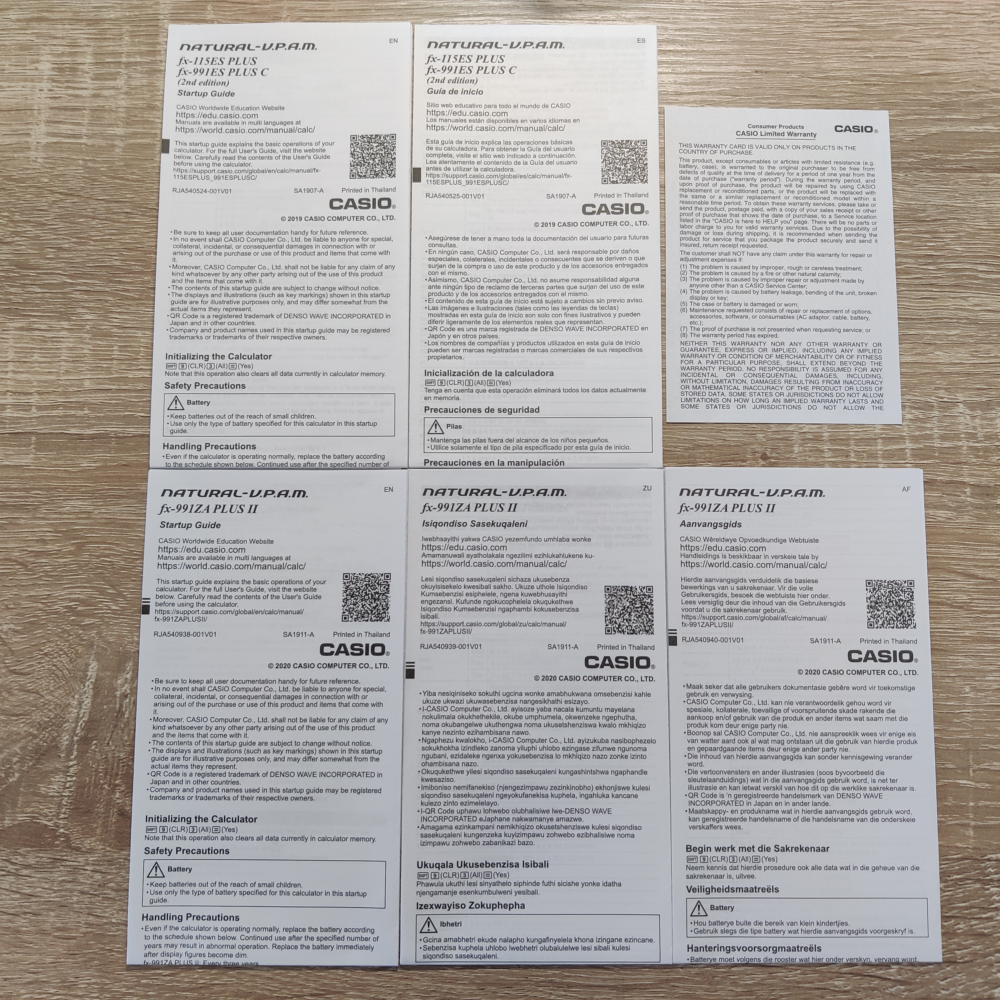

其中在fx-991ZA PLUS II附带的三语种的入门说明的最后都写明了南非的授权进口经销商为JAMES RALPH (PTY) LTD，并给出了授权进口经销商的网站地址。（但是越南销售的型号其入门说明却并没有写出卡西欧在越南的授权进口经销商为BITEX）

### 保护壳
在@喜羊羊第x代对fx-880BTG的[相关评测](https://tieba.baidu.com/p/8088620034)中已有详细介绍，可以做到从下方或上方扣上。
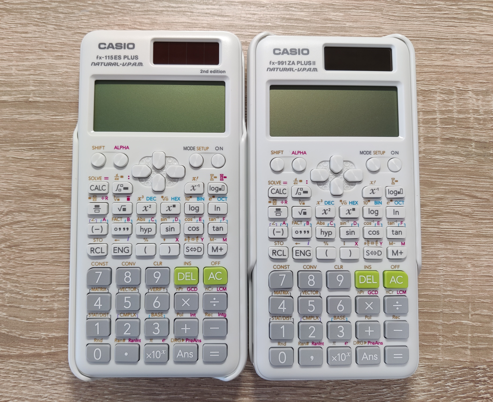

## 拆机
后期至今的泰国产的机型在太阳能面板背部和显示屏背部都用一张透明胶粘贴在了一起，猜测是为了防止松脱。

从这里也可以看出带太阳能的fx-ES PLUS Series -2nd edition-系列型号计算器并没有对电池仓设计开槽，而在入门说明和说明书中都是写明换电池需要拧下全部6颗螺丝打开后盖。（螺丝真的非常非常紧）
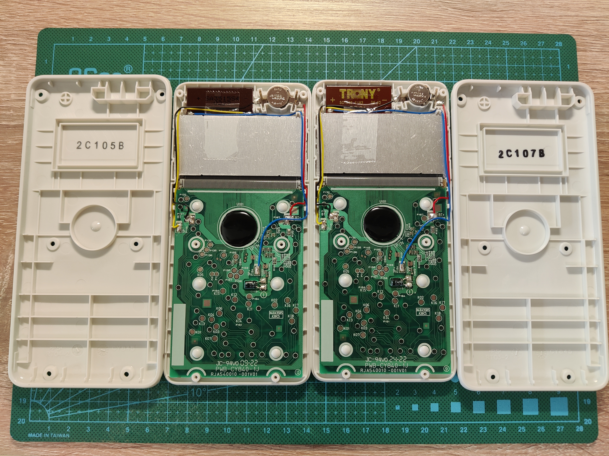

从电路板的印刷文字可以得知我这台fx-115ES PLUS 2nd edition的生产时间为2022年第9周（2月下旬），而fx-991ZA PLUS II的生产时间为22年的第24周（6月上旬）。

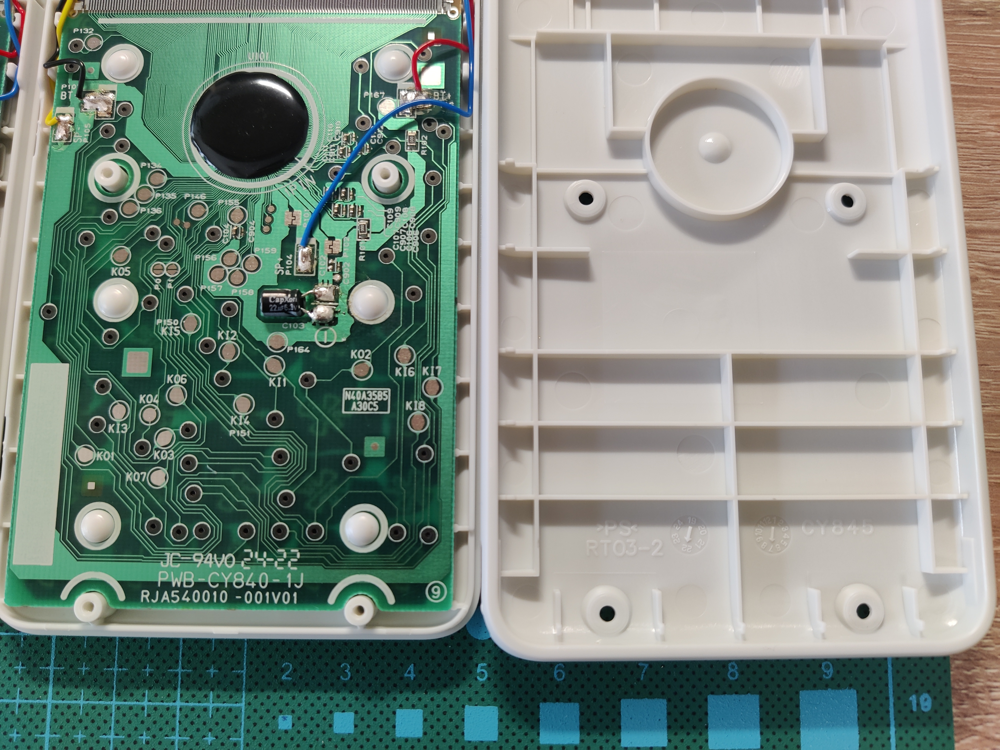

## 自检
fx-ES PLUS Series -2nd edition-系列与ClassWiz CW系列一样，具有假自检画面，这里就不贴图了，在@喜羊羊第x代对fx-880BTG的[相关评测](https://tieba.baidu.com/p/8088620034)中已有详细介绍，可自行前往查看。

按下`[SHIFT]` `[7]`+`[ON]`后接着按`[9]`后一路`[SHIFT]`即可看到自检的序列号界面。
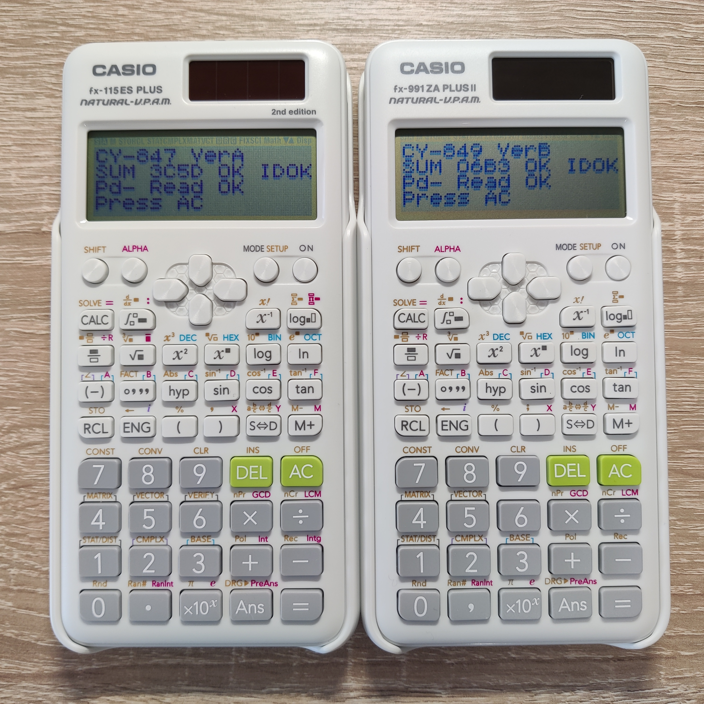

fx-ES PLUS Series -2nd edition-也引入了第三自检，`[SHIFT]` `[7]` +`[ON]`后接着按`[6]`即可进入。

## 开始（Get Started）
按下`[MODE]`后再按下`[0]`，会出现如下的界面。

扫描二维码进入网站并输入计算器的ID编号即可验证真伪以及查看在线用户说明书。

显示的二维码是写入固件的二进制图案，并非实时生成，不能改变。
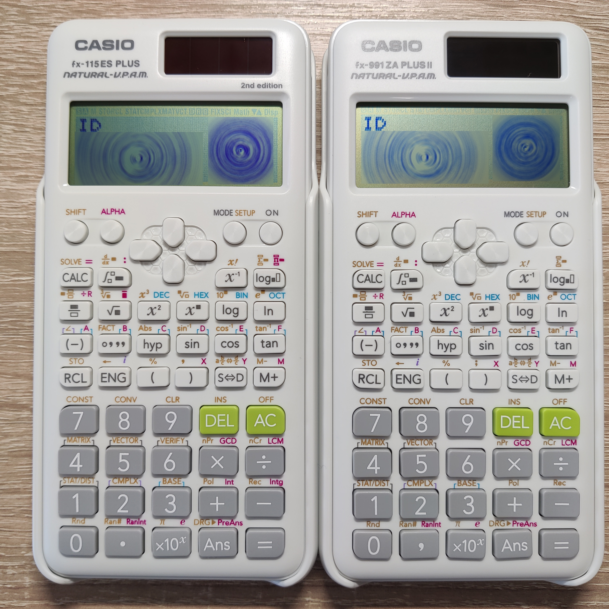

## 精度测试
内部精度保持在15位。

浮点运算的精度保持在40位。

不含π的算式结果含π的BUG依然可以复现。

## 系统设置
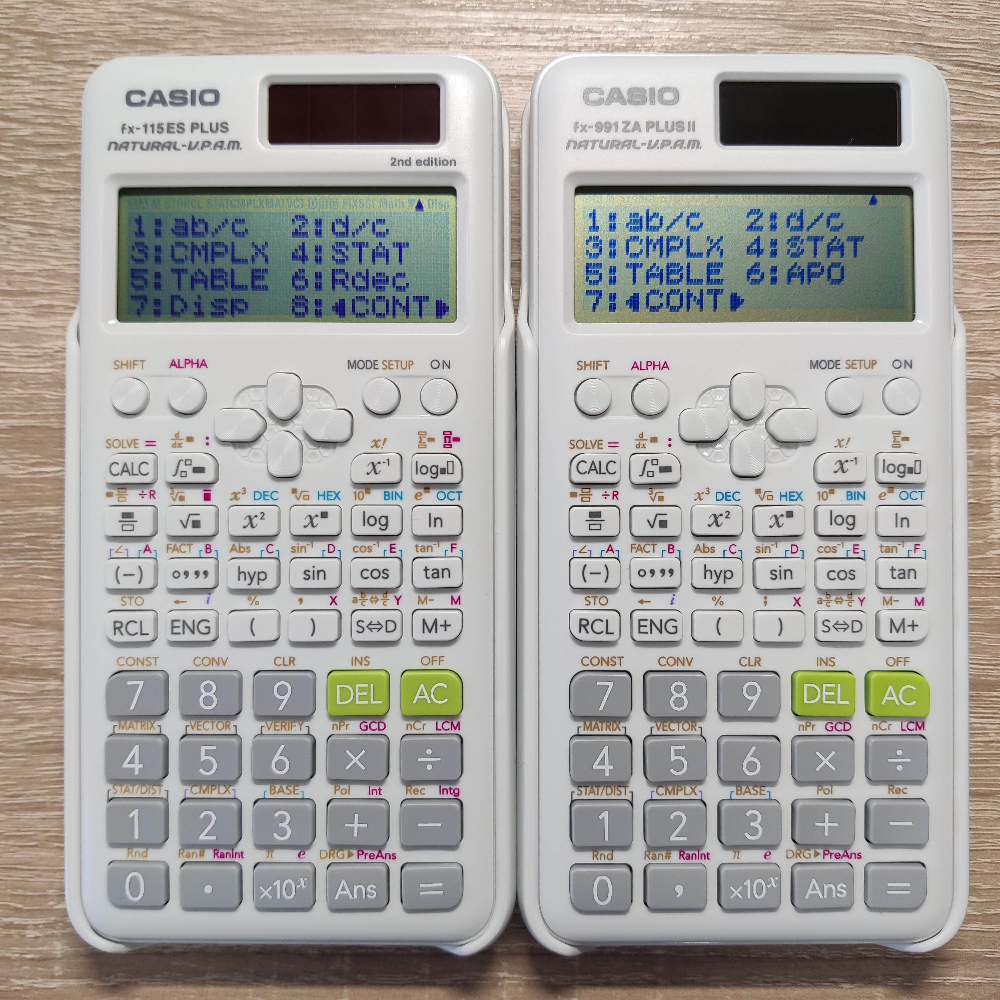
### 显示格式-常规(Norm)
fx-991ZA PLUS II和fx-82ZA PLUS II的显示格式初始默认（缺省）值均为Norm2，而包括fx-115ES PLUS 2nd edition在内的其他fx-ES PLUS Series -2nd edition-系列型号和旧型号fx-ZA PLUS基本均为Norm1。
")

### 循环小数设置(Rdec: Recurring Decimal Format)
fx-115ES PLUS 2nd edition跟fx-115ES PLUS一样有循环小数的功能，设置菜单内自然存在。

### 自动关机时间(APO: Auto Power Off)
fx-991ZA PLUS II和fx-991ZA PLUS一样具有自动关机时间的设置菜单，在fx-ES PLUS系列中，拥有自动关机时间的设置菜单的为DE PLUS、ID PLUS、ZA PLUS共3个地区的型号。fx-115ES PLUS 2nd edition和fx-115ES PLUS一样并不具备自动关机时间的设置菜单。
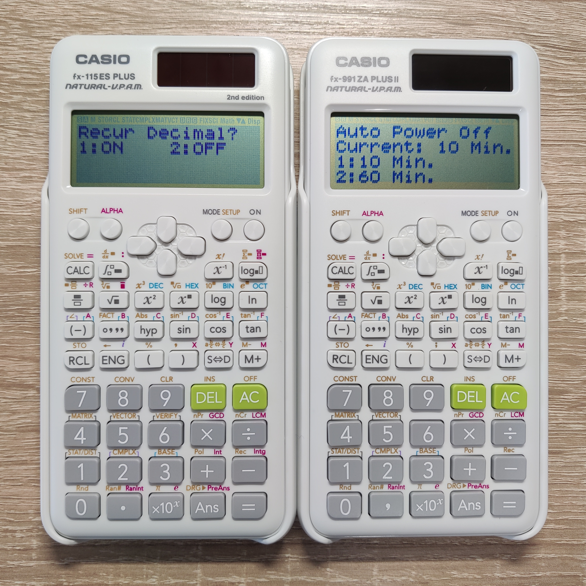

## 模式
从键盘按键功能印刷也可猜测fx-991ZA PLUS II和fx-115ES PLUS 2nd edition均为11模式，实际也是如此，除了fx-991ES PLUS基础的八模式和分布计算、不等式计算外，fx-991ZA PLUS II和fx-115ES PLUS 2nd edition的区别在于：fx-991ZA PLUS II配备了比例计算，fx-115ES PLUS 2nd edition配备了验证计算。~~虽然这俩都是鸡肋模式就是了~~
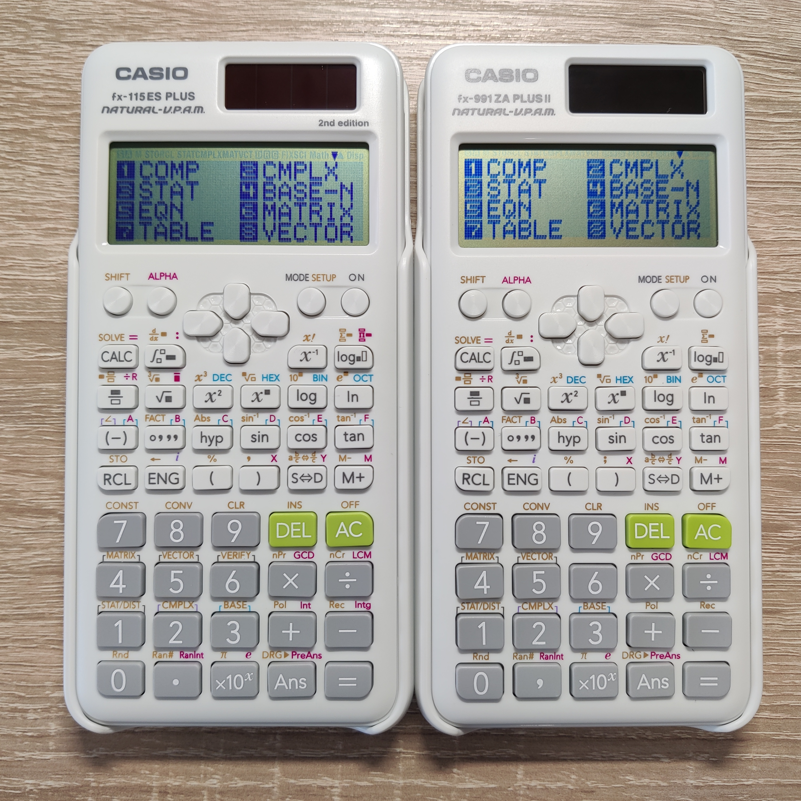
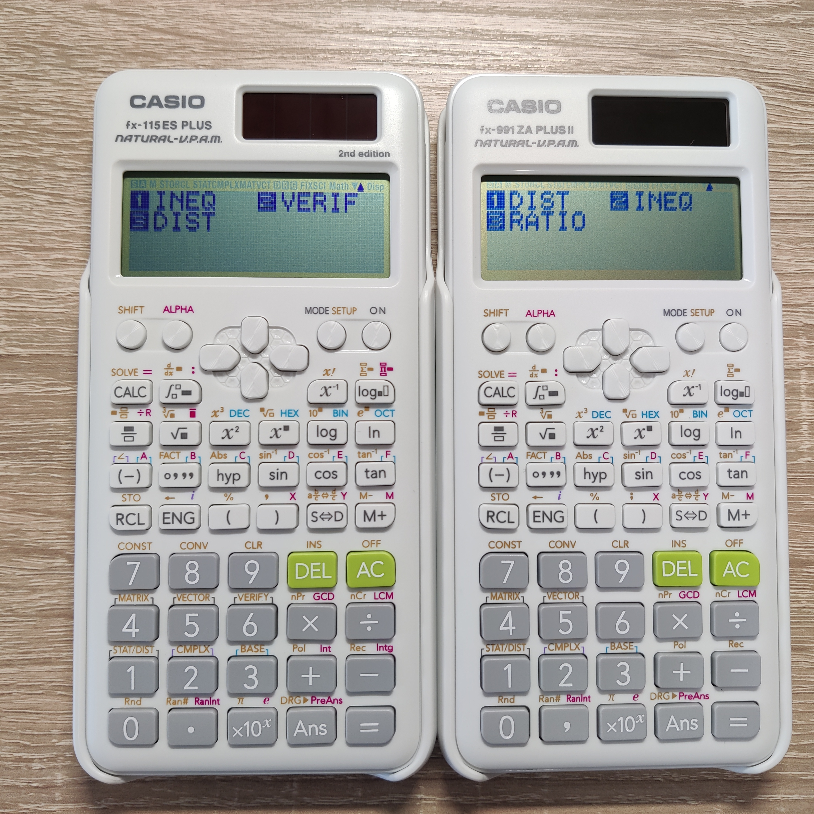

fx-991ZA PLUS II相比fx-115ES PLUS 2nd edition少了Int、Intg、大π（累乘）、循环节函数。

fx-991ZA PLUS II相比fx-991ZA PLUS增加了GCD、LCM、÷R函数，小数分隔符由点号(decimal point)改为了逗号(comma)，具体原因后文会讲。
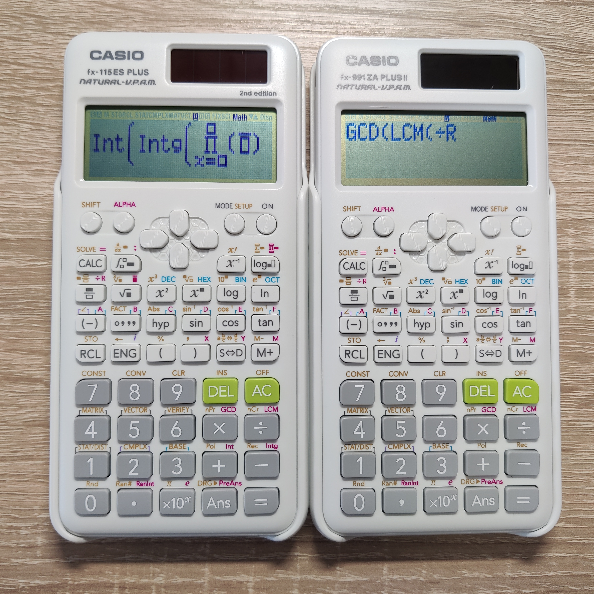
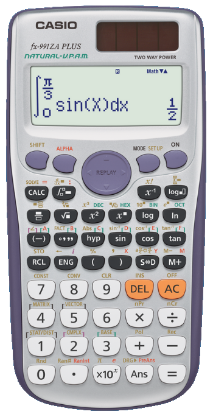
注：由于未购入fx-991ZA PLUS，fx-991ZA PLUS的图片来自南非官方进口经销商的网站[JAMES RALPH (PTY) LTD](https://www.casio.jamesralphedu.co.za/worksheets/p/casio-fx-991za-plus-complex-numbers-binary-decimal-angle-conversations)。

### 矩阵运算(MATRIX)
Ref/Rref函数两款机型均拥有。
")
### 其他模式没啥好讲的（摆烂

## 常数(CONST)
大部分的fx-ES PLUS系列和ClassWiz X系列机型的常数值均基于CODATA(2010)推荐值，而fx-991ZA PLUS II和fx-115ES PLUS 2nd edition作为fx-ES PLUS Series -2nd edition-系列的机型，其常数值均更新至基于CODATA(2014)推荐值。
")
_fx-115ES PLUS")
（fx-115ES PLUS的图片由[@喜羊羊第x代](https://tieba.baidu.com/home/main?id=tb.1.2062eec0.FwWcq4rwt0_gRZlb9o1EWA)提供）

注：注：fx-991DE PLUS的常数值基于CODATA(2007)推荐值；fx-991CE X的常数值基于CODATA(2014)推荐值；fx-991RS X的常数值基于CODATA(2018)推荐值；ClassWiz CW系列的常数值基于CODATA(2018)推荐值。

## 南非ZA型号计算器小数分隔符变动
fx-991ZA PLUS II和fx-82ZA PLUS II相较于fx-991ZA PLUS和fx-82ZA PLUS将小数分隔符由点号(decimal point)改为了逗号(comma)，国内有关南非的小数分隔符变动的讨论或资料极少，下文我将引用外网公开文献&讨论进行初步分析，不感兴趣者可以直接跳过。~~我怎么写个评测写出了论文的感觉~~

维基百科对小数分隔符有专门的说明：[https://en.wikipedia.org/wiki/Decimal_separator](https://en.wikipedia.org/wiki/Decimal_separator)

从历史角度来看，南非曾是荷兰人的殖民地，荷兰语中的小数分隔符为逗号(comma)，相类似的，印度尼西亚曾经也是荷兰人的殖民地，现在印度尼西亚的小数分隔符即为逗号(comma)，在我对fx-991ID PLUS的评测中也有展现。

在[StackOverFlow（IT技术问答网站）](https://stackoverflow.com/questions/3321096/)中提到，在2010年，微软的开发人员平台版本由.NET 3.5升级至了.NET 4.0，在en-ZA语言环境下的小数分隔符由点号(decimal point)改为了逗号(comma)，但根据fx-991ZA PLUS的说明书可得知fx-991ZA PLUS是在2014年左右上市的（具体时间不可考），并不能看出明显关联。

在南非的一个[科技产品交流论坛上](https://mybroadband.co.za/forum/threads/decimal-comma.193076/)，讨论人员在2009年的一次iOS更新中发现小数分隔符由点号(decimal point)改为了逗号(comma)，下方也有网友指出"*Using a decimal is with a comma its a South African standard*"。

而软件开发者Robert MacLean注意到了规则变动并进行了深入研究,并撰写了一篇[博客](https://www.sadev.co.za/content/how-correctly-format-currency-south-africa)。

南非的The Legal Metrology Act, 2014 (Act 9 of 2014)（法定计量法）和The Measuring Units and Measuring Standards Act, 2006 (Act 18 of 2006)（计量单位和计量标准法）中都描述了国际公制(the International Metric System)(SI)在南非的使用方法。

2011年南非的Government Communications & Information System(GCIS)发布了[Editorial Style Guide文件](http://www.gcis.gov.za/sites/default/files/editorial_styleguide_2011.pdf)："*decimal commas. Use decimal commas, not points: R300,45 not R300.45; 1 234,56 not 1,234.56.*"

2019年南非的SAHPRA组织发布了[SI Metric System文件](https://www.sahpra.org.za/wp-content/uploads/2020/01/2.38_SI_Metric_System_Mar19_v3.pdf)："*The comma is the only recognised decimal indicator for all numbers, including amounts of (currency) money.*"

即：南非的法定小数分隔符自1974年7月5日SI在南非引入以来一直都是逗号(comma)。

那么为什么2014年左右上市的fx-991ZA PLUS和2010年.NET 4.0推出之前所使用的.NET 3.5都是使用点号(decimal point)作为小数分隔符？

本人的观点是卡西欧及各大开发人员之前的本体化不完善，在大量消费者的反馈下开发者意识到了错误并将其修正。

## 异常相关
由于fx-ES PLUS Series -2nd edition-已将大部分异常修复，并且fx-991ZA PLUS II并没有稳定且价格合适的购入渠道（我也不推荐购买），所以不进行相关研究了~~（咕咕咕咕咕）~~。