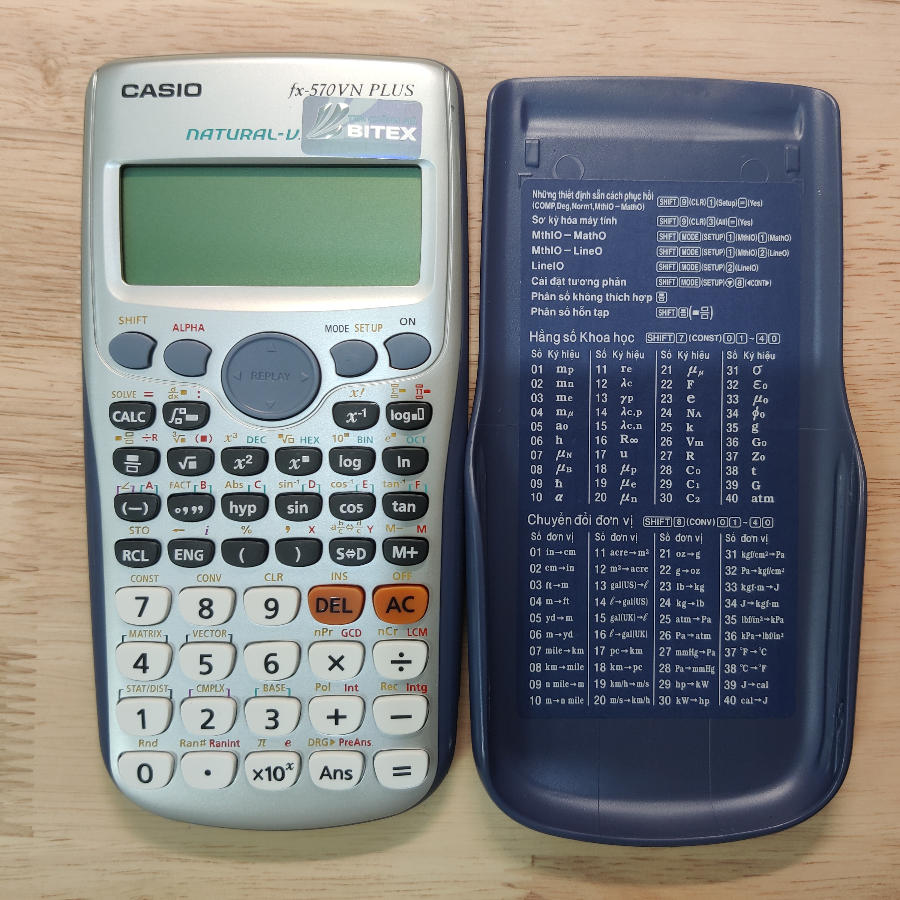
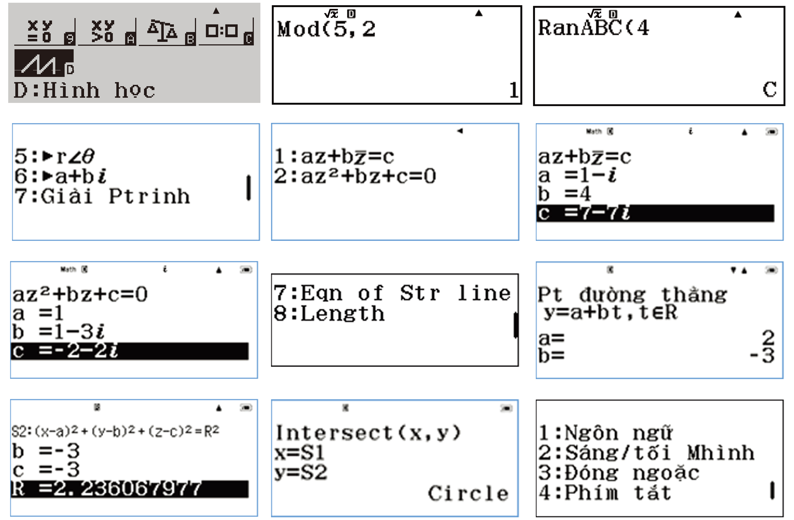

# **[fx-ES PLUS]fx-570VN PLUS简评**

>若网页中图片无法正常显示，请检查当前网络环境能否正常访问GitHub。


精度镇楼

## 阅读须知

1.  除非另有声明，本文的文字、图片等均为本人创作及拍摄，未经许可不得以任何形式对本文的全部或部分内容进行转载、复制、改编、发布至其他平台等。
2. 文中的信息均基于发帖日期所能获取到的最新信息，当读者阅读时信息可能已有变化，一切均以最新消息为准。
3. 文中对计算器的描述等均属本人的主观感受，部分表述可能不够准确，若有疑惑欢迎指出。
4. 除非另有提及，否则文中出现的所有实际产品均为本人自费购买，本文不构成任何购买建议。
>注：部分阅读须知内容来自[@喜羊羊第x代](https://tieba.baidu.com/home/main?id=tb.1.2062eec0.FwWcq4rwt0_gRZlb9o1EWA)

## 写在前面

感谢[@喜羊羊第x代](https://tieba.baidu.com/home/main?id=tb.1.2062eec0.FwWcq4rwt0_gRZlb9o1EWA)对本文的补充以及存在错误的指正！

在各种机缘巧合下，我得到了一台成色挺不错且箱说全的fx-570VN PLUS，由于贴吧内没有人发过实机的图片，我想了想决定拍了些照片，写了以下这一点点评测。

fx-ES PLUS系列由于销售范围之广，拥有非常多的地区本地化机型。但由于该系列研发时的技术限制，在功能上远不及之后的X系列以及现在的CW系列之多和强大，因此有一部分的地区本地化机型可能只是做了符号和包装说明的本地化，在功能上与基础型号fx-991ES PLUS的差别相差无几，我也不太可能会将全部的fx-ES PLUS系列型号一并购买收集并且编写联合评测。

不过对于之后的ClassWiz X系列，全国家地区型号的收集我与已经贴吧内另一位已经实现，可以期待其后续的联合评测（


## 简要介绍

fx-570VN PLUS是卡西欧在越南销售的本地化机型，后续升级机型分别是fx-580VN X以及fx-880BTG。

越南同系列还有一款fx-500VN PLUS型号的计算器，目测是在fx-95ES PLUS的基础上增加了越南的循环节函数功能。

在越南销售的卡西欧计算器一直都不具备太阳能供电，但丝毫不影响fx-570VN PLUS的功能之强大。除开因拓展单位转换以及日版的元素周期表而直接排在第一第二的fx-995ES和fx-991DE PLUS，fx-570VN PLUS和fx-115ES PLUS(fx-991ES PLUS C)可以说是并列第三，具体后文会稍加说明。

由于fx-570VN PLUS内部语言并没有本体化以及其本身的稀有性和没必要性，本评测基本只会展示fx-570VN PLUS的一些特点功能，并不会提及比较详细的功能说明和异常相关。


## 外观

可以看到包装内包含计算器本体、汽泡纸袋、说明书、保修卡、防伪说明。

说明书为越南文，语言代码为Vn。


通过计算器本体后盖上的信息可以看到这台fx-570VN PLUS已经属于后期由泰国生产的批次了。你可能会发现后盖上被印刷上了两行文字，稍候将会进行说明。


保修卡的背面是当时的销售商填写的信息，防伪说明的另一面是是对卡西欧在越南的进口经销商BITEX的介绍。


如果有看过由[@喜羊羊第x代](https://tieba.baidu.com/home/main?id=tb.1.2062eec0.FwWcq4rwt0_gRZlb9o1EWA)写的[fx-880BTG评测](https://tieba.baidu.com/p/8088620034)的话，你可能会对外包装上的几张贴纸感到眼熟。

这里放上fx-570VN PLUS、fx-580VN X、fx-880BTG三者的外包装。包装上的贴纸应该均是由BITEX经销商贴上的。在刚刚展示的保修卡上有说明fx-570VN PLUS的保修时长为2年，而后期生产的fx-580VN X以及fx-880BTG都提供了7年的质保。具体翻译可见[fx-880BTG的评测](https://tieba.baidu.com/p/8088620034)。


三者外包装的背面也均有贴纸写明了BITEX经销商的信息。

可以发现fx-570VN PLUS和fx-580VN X的外包装均为越南语、英语双语，而fx-880BTG的外包装上只剩下了越南语。


正面可以看到BITEX那硕大的防伪贴纸，通过键位功能印刷不难看出fx-570VN PLUS拥有DIST分布模式以及大π（累乘）、循环节函数、质因数分解(FACT)、÷R、GCD、LCM、Int、Intg和PreAns功能。

保护壳贴纸已经本地化为越南语。



fx-ES PLUS系列的保护壳贴纸除开国际型号的英语外，还有大陆地区销售的中文（没摆出来）、日本销售的日语、越南销售的越南语、德国销售的德语、北美销售的英语+法语、印度尼西亚销售的印度尼西亚语、法国销售的法语以及拉丁美洲销售的西班牙语（没有图）。


左侧为fx-570VN PLUS的保修卡以及防伪说明，右侧为后期生产的fx-580VN X以及fx-880BTG的保修卡以及防伪说明。所展示的防伪检测方法可见[fx-880BTG的评测](https://tieba.baidu.com/p/8088620034)。


防伪说明的背面可以看到从ES PLUS系列原本的BITEX介绍改为了ClassWiz系列的保修的信息以及手机端查询真伪的方法。


你可能已经注意到了，计算器本体后壳上印刷的两行文字跟保修卡上所印刷的是一样的。印刷内容如下：
```
CASIO_fx_570VN PLUS
07/2017_ĞS_54256
```
其中的`07/2017`应该是销售时间，而`ĞS_5425`6尚不清楚其含义。


>（该图片经过调色处理使得印刷文字更清晰，实际印刷颜色较浅，基本看不清楚）

## 模式功能

fx-570VN PLUS具有11个模式，除开fx-995ES的10个模式外，还具备RATIO比例模式，但不具备VERIF验证模式。


### PreAns

fx-570VN PLUS拥有PreAns。此外，还有日本的fx-375ES、fx-915ES、fx-995ES、fx-520AZ四款型号，北美地区的fx-300ES PLUS、fx-115ES PLUS、fx-991ES PLUS C三款型号，南非的fx-82ZA PLUS、fx-991ZA PLUS两款型号，以及澳大利亚的fx-100AU PLUS也都拥有该功能。


### 循环节函数

越南的小数循环节使用的是括号而非上点或者上划线。其他拥有小数循环节函数功能的型号：越南的另外一款fx-500VN PLUS型号，日本的fx-375ES、fx-915ES、fx-995ES、fx-520AZ四款型号，北美地区的fx-300ES PLUS、fx-115ES PLUS、fx-991ES PLUS C三款型号，英国的fx-83GT PLUS、fx-85GT PLUS两款型号，德国的fx-86DE PLUS、fx-87DE PLUS、fx-991DE PLUS三款型号，印度尼西亚的fx-991ID PLUS型号。

据查阅的资料，越南其实使用逗号作为小数分隔符，但为何越南的计算器全部使用点作为小数分隔符我懒得去探究了（


### 自动添加括号

fx-570VN PLUS会自动添加括号。部分早期fx-ES PLUS机型（ES国际型号、北美地区的fx-300ES PLUS、fx-115ES PLUS、fx-991ES PLUS C三款型号、GT英国型号、DE德国型号、fx-92 College 2D+以及fx-92B College 2D+两款型号）并没有该特性。


### CMPLX（复数计算）

fx-570VN PLUS可计算复数i的4次方(i^4)。此外还有fx-991ID PLUS、fx-991ZA PLUS、fx-100AU PLUS三款型号可以计算，可以看到都为fx-ES PLUS系列后期推出的本地化机型。早期的如fx-991ES PLUS等机型则不支持，会报数学错误。


### TABLE（数表计算）

fx-570VN PLUS具备g(x)定义生成功能。此外也具备该功能的有日本的fx-375ES、fx-915ES、fx-995ES、fx-520AZ四款型号、北美地区的fx-300ES PLUS、fx-115ES PLUS、fx-991ES PLUS C三款型号，南非的fx-82ZA PLUS、fx-991ZA PLUS两款型号。


### MATRIX（矩阵计算）

fx-570VN PLUS的不具备Ref（行阶梯形式）和Rref（简化行阶梯形式）矩阵函数计算功能。具备该功能的有日本的fx-915ES、fx-995ES、fx-520AZ三款型号、北美地区的fx-115ES PLUS、fx-991ES PLUS C两款型号，德国的fx-991DE PLUS以及南非的fx-991ZA PLUS。


### CONST 科学常数

fx-570VN PLUS以及大部分的fx-ES PLUS系列和ClassWiz X系列机型的常数值均基于CODATA(2010)推荐值。（另：fx-991DE PLUS的常数值基于CODATA(2007)推荐值）


## 自检

可知自检号为`LY710X`，且为`VerA`版本。


## 拆机

后壳内喷墨`7C104A`，PCB电路板上的`09-17`说明电路板生产时间为2017年第9周。


后壳内两个数字分别为`17`和`1`，推测外壳模具浇筑时间为2017年1月。


## 本地化思考

为何越南作为一个发展中国家，卡西欧在其国家推出的本地化的型号会如此强大？稍微调查一下越南的教育和市场情况或许能猜测作答。

根据越南的《高级中等学校毕业考试条例》，仅仅在其第 14 条第 4 款第 m 点中对考试中使用的计算器的文字编辑以及存储的功能做出了限制，此外没有任何额外的限制要求。

虽然不好开口，但中国大陆和越南可以说是两大计算器盗版销售地区，从两国销售的计算器上的防伪贴纸就能一探究竟。不像我国的伊达时、得力等厂商，在考纲对计算器功能基本无限制的背景下，越南的几大本土计算器厂商（VinaCal、Flexio等）在卡西欧原本的功能基础上，除开破解Casio函数计算器原本的功能外，还加入了许许多多独创的功能。我猜测卡西欧为了保障越南的市场份额，便把大部分已研发出的功能都加入了fx-570VN PLUS。

当然，除开官方的法律法规条例文件外，其他都仅仅只是我个人的猜测。本人并不认可盗版行为也不提倡购买盗版商品。

附图是Flexio推出的Fx799VN型号计算器的部分功能截图。



顺便附上上文提及的《高级中等学校毕业考试条例(BAN HÀNH QUY CHẾ THI TỐT NGHIỆP TRUNG HỌC PHỔ THÔNG)》的相关条例原文：
```
[15/2020/TT-BGDĐT] (Điều 14. 4. m) máy tính bỏ túi không có chức năng soạn thảo văn bản, không có thẻ nhớ (cụ thể trong hướng dẫn tổ chức kỳ thi tốt nghiệp THPT hằng năm của Bộ GDĐT)
```

以及附图为越南教育和培训部(BỘ GIÁO DỤC VÀ ĐÀO TẠO)在2022年6月3号下发的2022年高级中等学校毕业考试计算器准入清单(V/v danh sách một số máy tính bỏ túi được đem vào phòng thi trong Kỳ thi tốt nghiệp THPT năm 2022)

可以说清单中除了卡西欧的6个型号，其余的均为盗版，不过从各厂对生产的计算器的型号编号来看，除了Deli（得力）和Eras（伊达时），其他均有型号是增加了额外的功能。


## Fin.

评测到此结束。

放张三代计算器的模式列表以及自检版本号当结束图。


