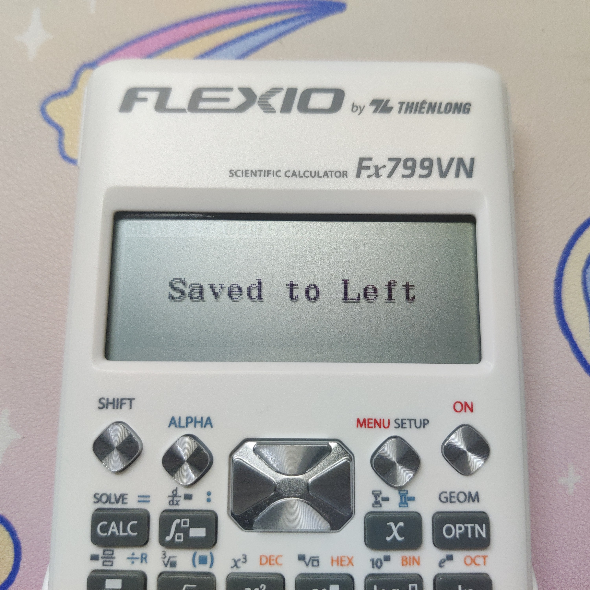
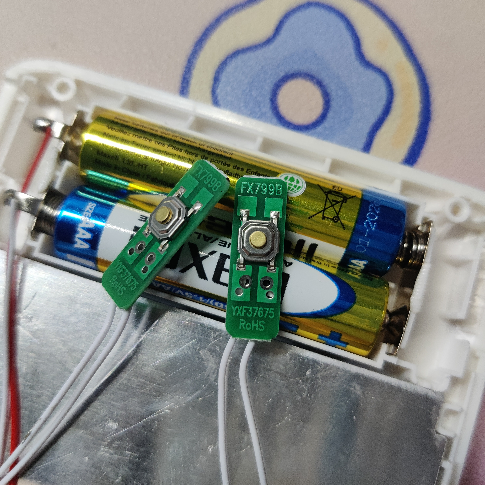
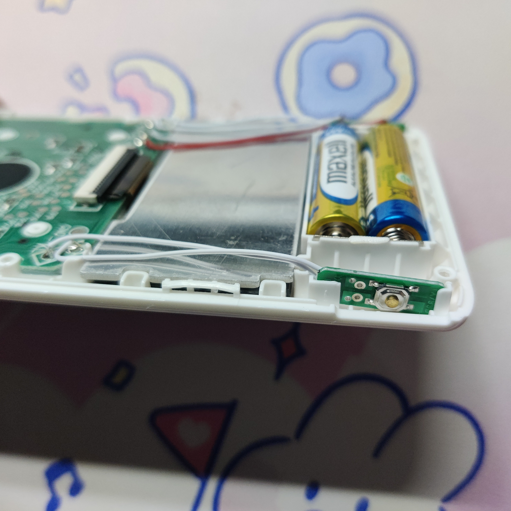

# **\[创新？盗版？\]Flexio Fx799VN评测**


>若网页中图片无法正常显示，请检查当前网络环境能否正常访问GitHub。


Geometry（几何）模式镇楼

# 阅读须知

1. 除非另有声明，本文的文字、图片等均为[本人](https://github.com/ZWolken)以及[喜羊羊第x代](https://tieba.baidu.com/home/main?id=tb.1.2062eec0.FwWcq4rwt0_gRZlb9o1EWA)创作及拍摄，未经许可不得以任何形式对本文的全部或部分内容进行转载、复制、改编、发布至其他平台等。
2. 文中的信息均基于发帖日期所能获取到的最新信息，当读者阅读时信息可能已有变化，一切均以最新消息为准。
3. 文中对计算器的描述等均属本人的主观感受，部分表述可能不够准确，若有疑惑欢迎指出。
4. 除非另有提及，否则文中出现的所有实际产品均为本人自费购买，本文不构成任何购买建议。
5. 本人并不认可盗版行为也不提倡购买盗版商品。
6. Fx799VN是越南教育和培训部颁布的《高级中等学校毕业考试条例》文件所批准的机型，其内置的新增功能是经过越南教育和培训部批准的，在越南境内并不违规。本人反对一切对于大陆境内批准的考试用计算器机型的改装行为。
7. 本文章内“盗版”、“山寨”、"fake"、"clone"均认为是同一含义，不进行区分。
>注：部分阅读须知内容来自[喜羊羊第x代](https://tieba.baidu.com/home/main?id=tb.1.2062eec0.FwWcq4rwt0_gRZlb9o1EWA)

# 写在前面

在之前对[fx-570VN PLUS的评测末尾](https://zwolken.github.io/Calc_Review/docs/04_570VNPLUS/#%E6%9C%AC%E5%9C%B0%E5%8C%96%E6%80%9D%E8%80%83)，我提到过越南地区Flexio销售的Fx799VN型号计算器的部分功能截图，可以看到Flexio在Fx799VN上增加了一些额外的功能。

当时对于Flexio的Fx799VN评测即在规划中，也就是现在各位看到的这一篇文章。

计算器由[喜羊羊第x代](https://tieba.baidu.com/home/main?id=tb.1.2062eec0.FwWcq4rwt0_gRZlb9o1EWA)跟我一同购买，**评测中对Geometry（几何）模式的介绍使用部分由[喜羊羊第x代](https://tieba.baidu.com/home/main?id=tb.1.2062eec0.FwWcq4rwt0_gRZlb9o1EWA)编写**。

评测中会出现卡西欧的fx-580VN X、fx-880BTG和fx-115ES PLUS型号的对照，出于对比目的，前两者将会设置为越南语环境。

请注意：本人并不认可盗版行为、也不提倡购买盗版商品。若需正常计算使用还请购入正版计算器机型以防止因计算BUG等导致产生不可挽回的损失。

# 简要介绍

开门见山，Fx799VN相对与卡西欧fx-580VN X和fx-880BTG计算器型号的最显著特色功能有这些：几何模式(Geometry)、复数方程求解、自定义功能快捷键(Function Shortcut)。

通过镇楼图各位也能看到计算器本体正面外壳上有一行文字：FLEXIO by THIÊNLONG

据Wikipedia描述，THIÊNLONG是一家专业从事文具和美术工具的越南本土公司。而FLEXIO我个人认为是THIÊNLONG旗下对办公学习用品划分的子品牌。

这篇文章所评测的型号是Fx799VN，据互联网资料检索应该是今年(2023年)6月份推出的新型号。其同系列前型号从旧到新分别为Fx590VN、Fx680VN、Fx680VN Plus。Fx590VN是卡西欧ES PLUS时代fx-570VN PLUS的对应型号，Fx680VN是fx-580VN X对应的型号，而Fx680VN Plus和Fx799VN均为基于FX680VN的功能增加更新型号。

通过上述描述各位应该也能意识到Fx799VN并不是fx-880BTG的对应型号，仍然是fx-580VN X的山寨+更新，因而卡西欧ClassWiz CW系列的新键盘布局和诸多硬件软件新特性Fx799VN并不具备。

# 包装及外观

外包装为纸盒，其正面展示了几个最主要的特色功能，跟卡西欧越南销售的计算器型号一致，都提供7年的质保。右下角的二维码通往其保修网站。


侧面的贴纸是THIÊNLONG官方商城的2023年活动。


包装盒背面右下的部分内"Sản xuất tại Trung Quốc"，就是喜闻乐见的Made in China，嗯，目前的盗版型号基本都还是中国生产。"Năm sản xuất: 2023"，生产年份为2023年。背面的几张屏幕截图均是对特色功能的介绍。


包装盒内包含：计算器本体、新功能介绍说明书、泡泡纸袋、防潮袋、THIÊNLONG卡通贴纸（背面有官网活动的抽奖兑换码）。


计算器本体共有紫黑白红四种配色，我这台是白色的配色。


>该图来自THIÊNLONG官网产品销售界面：[链接](https://thienlong.vn/products/may-tinh-khoa-hoc-thien-long-flexio-fx799vn)

计算器正面的按键布局跟卡西欧的fx-580VN X型号并不完全一致，跟FLEXIO前几代的按键分布一样，OPTN键位于第一行的最右侧，其他三个功能键均左移；OPTN的第二功能键GEOM只在几何模式(Geometry)内生效；数字0拥有第三功能键RanABC；数字5拥有第二功能键自定义功能快捷键(Function Shortcut)设置键；数字6拥有第二功能键Mod。上述内容具体均会在后文进行说明。


可以看到由于两侧的按键而形成了这个大额头的造型（前一款型号Fx680VN Plus两侧没有按键，不存在大额头），两侧按键具体的作用后文会说明。


计算器背面标注了THIÊNLONG的商标、一行字`Product of Thien Long Group Corporation`，没有标注产地。贴纸以及二维码都是保修相关。


包装盒内侧印刷有`20230530`的字样，可以判断这应该是生产组装时间。


注意，新功能介绍说明书并不类似于卡西欧新生产机型附带的启动指南(Startup Guide)说明纸。卡西欧的启动指南(Startup Guide)说明纸有明确说明只介绍了基本操作，并给出了完整用户说明书的网站链接。

而这份新功能介绍说明书仅仅只印刷了复数方程求解、几何模式(Geometry)、自定义功能快捷键(Function Shortcut)三个新功能的使用说明。对于完整的用户说明书，说明书内完全没有给出文字说明引导。


在这份说明书的最后一页有一个通往THIÊNLONG保修网站的二维码，你可以自行搜索前往保修网站的Fx799VN介绍页，在介绍网页的最底部有给出完整的用户说明书的下载地址。但请再次注意，完整的用户说明书的下载地址在这份新功能介绍说明书内完全没有任何文字说明或引导，就孤零零的一个二维码放在最后一页，可以说用户体验极差。


顺便提一嘴，新功能介绍说明书、完整用户说明书内的屏幕截图分辨率完全不统一，可以推测有些是直接照搬卡西欧fx-580VN X的说明书图片、有些是THIÊNLONG自己的截图；在英文版的用户说明书内，有些图片就像缺墨一样还有阴影（网站下载PDF文档，并非打印），可以推测应该是直接对着计算器屏幕拍照然后再经过图片处理软件处理成黑白的。（几个说明书PDF文档都可前往[GitHub存档仓库](https://github.com/ZWolken/dentaku_doc)下载）

# 菜单 & 特色功能

主要介绍说明该型号与卡西欧的fx-580VN X有区别或者独特之处，相同的功能不会介绍说明。若子标题后没有在括号内注明英文，则该功能并没有官方名字，为我个人所命名。

## 求余计算(Mod)

于卡西欧ES PLUS时代同期的Fx590VN型号上就已经实装。与÷R运算不同的是，÷R的运算结果会同时显示商和余数，但可赋值给变量的只有商的结果，而Mod计算的结果就只有余数。该功能函数可通过`ALPHA`+`6`键入，卡西欧ES PLUS时代同期的Fx590VN型号也是完全一致的输入方式，个人认为从此便可窥探盗版机系统的一处屎山代码。

")

## 连续的菜单序号

于Fx680VN上实装，以矩阵模式的OPTN菜单为例，可以看到第二页的序号是接着上一页的序号的，因而当1~9不够用时，会出现分配到A等字母按键的菜单。


而双曲函数、角度单位、工程符号三个常驻OPTN菜单直接分配到了`x`、`y`、`z`按键。


另外，科学常数和单位换算的一级菜单也是如此设计，也就是说可以直接按下`SHIFT`+`8`+`6`+`7`来输入`lbf/in²▸kPa`，而不像卡西欧ClassWiz初代需要用`SHIFT`+`8`+`↓`+`2`+`7`。不得不说这样的设计非常适合盲打使用。


SETUP设置菜单不具备此特性。

## 自动补齐右括号(Auto-close bracket)

于Fx680VN上实装，在SETUP设置内将第4页第3项`Close bracket|Đóng ngoặc`项设置为开启`On|Sử dụng`后，在任意支持输入括号的位置，若当前光标所在输入层次后方无内容，在键入左括号或者任何带左括号的函数功能后，会自动补齐右括号，光标保持在左右括号之间。

")

此时按下`DEL`仅会删除光标前的字符，后面的右括号仍保留。

## 随机字母(Random letters RanABC)

于Fx680VN上实装，只支持在基础计算模式下使用，最大支持A~J范围内的字母随机，即`RanABC(2)`~`RanABC(10)`，输入1会报参数错误(Argument Error\|Lỗi đối số)，超过10后会报数学错误(Math Error\|Lỗi phép tính)。若在其他的模式下，要么无法输入该功能函数，要么输出的是输入设定的参数数值，而并非随机字母。

")

虽然但是，这个功能除了考场抓阄外我想不出其他用途。

## 快速移动光标

于Fx680VN上实装。对于同期的卡西欧ClassWiz一代以及新推出的CW系列，在拥有多层次的自然书写“函数模版”内，可通过键入SHIFT+左/右方向键的快捷键，控制光标在函数模版的最左和最右侧之间跳转。

而对于Flexio推出的Fx680VN以及往后的机型来说，SHIFT+左/右方向键可以实现光标跳转到式子的开始位置和结束位置，并且还支持使用SHIFT+上/下方向键在函数模版的最上和最下侧之间跳转。比较滑稽的是，仔细看能看出光标在上下跳转时的过程，说明该功能的实现原理是，模拟按上/下方向键，直到光标位置不变为止（有一种屎山的美）。

```c++
do {
	lastPosition = getCursorPosition()
	keyPress(actionKey)  // `Up` key or `Down` key
} while (lastPosition != getCursorPosition())
```

## 求解复数方程(Solve complex equations)

于Fx680VN Plus上实装，在复数(Complex\|Số phức)模式下进入OPTN菜单，第7项`Solve Poly|Giải P(hức)thích`即为复数方程求解功能，支持二次复数方程和三次复数方程。

thích")

这里以说明书上的举例来说明：求解𝑧²+(1−3𝑖)𝑧+(−2−2𝑖)=0

选择OPTN内求解功能选项，选择第2项`𝑎𝑧²+𝑏𝑧+𝑐=0`，`𝑎`输入`1`，`𝑏`输入`1−3𝑖`，`𝑐`输入`−2−2𝑖`，按下`=`键求解，即可得`𝑧₁=2𝑖`; `𝑧₂=-1+𝑖`，即为该复数方程的解。


## 几何模式(Geometry mode)

> 该部分由[喜羊羊第x代](https://tieba.baidu.com/home/main?id=tb.1.2062eec0.FwWcq4rwt0_gRZlb9o1EWA)编写。

前身为在Fx680VN上实装的Point模式，后续在该模式的基础上增加了功能，变成了Fx680VN Plus上开始搭载的几何模式。也正因为此，该模式的操作逻辑十分混乱，无法想象这是正常逻辑编写程序代码能写出的程序。

进入几何模式，首先要选择的是几何体类型。虽从模式界面而言说是一个模式，但它根据几何学中的基本元素，即点（Point\|Điểm）、线（Line\|Đường thẳng）、面（Plane\|Mặt phẳng）、圆（Circle\|Đường tròn）、球（Sphere\|Mặt Cầu），实际上分成了5个子模式。


计算画面右下角区域显示的也是当前子模式的名称，而不是几何Geometry\|Hình học。


在几何模式中，OPTN菜单内只提供了当前的所在子模式的特定功能。


要在不同的子模式之间切换，或者跨几何类型的计算，都需要通过\[SHIFT\]+\[OPTN\]进入另外的的GEMO菜单，而不是在OPTN菜单中操作，按键功能层次的定位冲突导致体验非常割裂。


在“点”子模式下，可定义二维点或三维点，并可求解两点形成的直线方程（Eqn of Str line\|Pt đường thẳng）和长度（Length\|Độ dài）。


对于求出的直线方程结果，如果输入二维点（即平面直线），则求解出𝑦=𝑎𝑥+𝑏的形式。


若是三维点，则求解出参数方程的格式，依次给出𝑥, 𝑦, 𝑧三个方向对于𝑡的参数。这个参数方程在几何意义上，为直线上的一点与直线的方向向量。


类似的，“圆”子模式下则可以求圆的面积。


在“球”子模式里可以求球体的表面积、体积。


但在“线”或者“面”子模式中，对于定义完成的线或者面，对应的子模式不具备各自的几何计算功能，线以及面变量只能用于跨类型计算。

定义“线”时用的也是参数方程形式，可定义三个参数，如果是平面直线，将其中一个参数都设置为0即可。“面”的定义则为𝑎𝑥+𝑏𝑦+𝑐𝑧+𝑑=0的形式。


跨几何体类型间的计算有两类，相交计算（Intersect\|Tương giao）以及距离计算（Distance\|Khoảng cách）。先来看情况较为简单的距离计算。

通过GEMO菜单进入距离计算画面后，需选择两个待计算的几何体。选择方式可以用左右方向键顺次切换，也可按下OPTN打开菜单一览后按键选择。


非常奇葩的是，在这个计算功能中“点”只能选择点A、点B、点C这3个变量，点D变量直接消失了。考虑到其余4种几何体都只能定义3个，显然这是为了妥协而写出的屎山代码。


当选择的两个几何体是两个点时，该功能和在“点”子模式下用“长度”函数计算并无二异。除了计算两点距离，还可计算点到线、点到面的距离。如果输入的是两个不支持的几何体，例如计算两个面的距离，即使两面平行，也会报语法错误。


相交功能计算的是两个几何体的相交情况，例如垂直、平行、相切等，交互操作方法和计算距离的一样。


该功能可以计算的几何体类型组合还是较为完善的，可计算两直线之间、两平面之间、两圆之间、两球体之间、直线与平面、直线与圆、直线与球体、平面和球体的相交情况。说明书中给出了较为完整的计算功能示例，这里选取部分计算结果的画面供参考。

两直线垂直但不相交（也即异面垂直）\[𝑑1=(1+𝑡, 2-3𝑡, 3-5𝑡)，𝑑2=(2+2𝑡, -2-𝑡, 3+𝑡)\]


两直线交叉（不平行不垂直不相交，也即异面直线）\[𝑑1=(1+𝑡, 1-𝑡, -2-2𝑡)，𝑑2=(2+𝑡, 1-𝑡, 1)\]


两平面垂直 \[𝑃1: 3𝑥-5𝑦+6𝑧-3=0，𝑃2: 𝑥+3𝑦+2𝑧+5=0\]


两平面平行 \[𝑃1: 2𝑥+2𝑦-𝑧+12=0，𝑃2: 2𝑥+2𝑦-𝑧-18=0\]


两平面重合 \[𝑃1: 𝑥-𝑦+2𝑧-4=0，𝑃2: 10𝑥-10𝑦+20𝑧-40=0\]


𝑥𝑂𝑦平面中，直线与圆相切于一点 \[𝑑1: 𝑥-𝑦+2=0，𝐶1: (𝑥+1)²+(𝑦+1)²=2\]（其中直线𝑑1: 𝑥-𝑦+2=0需转换成参数方程表示为(𝑡, 2+𝑡, 0)输入）


两球不相交 \[𝑆1: (𝑥-1)²+(𝑦-1)²+(𝑧-1)²=1，𝑆2: (𝑥-3)²+(𝑦-3)²+(𝑧-3)²=1\]


直线位于平面上 \[𝑑1=(-3+𝑡, 2-2𝑡, 1)，𝑃1: 2𝑥+𝑦+3𝑧+1=0\]


球体与一平面相交形成一圆[𝑃1: 2𝑥+𝑦-𝑧=0，𝑆1: 𝑥²+(𝑦-1)²+(𝑧+2)²=9]


不过，该功能也存在一些匪夷所思的bug。例如定义两条空间中互相垂直的直线𝑑1=(0, 5, 𝑡)，𝑑2=(𝑡, 5, 5)，计算它们的相交情况时得到的却是重合，而不是垂直。


## 自定义快捷键(Function Shortcut)

为本型号Fx799VN上新推出功能。可以理解为宏按键，左右两个快捷键各支持最多6个按键或按键组合的记录，该功能仅支持在计算模式和复数模式内使用。

在SETUP设置内将第4页第4项`Shortcut Func|Phím tắt`项设置为开启`On|Sử dụng`后，即可使用该功能（即使关闭也能正常录入按键，但长按快捷键不会有反应）。

键入SHIFT+5在菜单中选择左按键或者右按键，随即开始记录，此时屏幕内提示栏内的自定义快捷键图标亮起。

")


可通过SHIFT+5或者=键退出录制模式并保存；亦或在记录满6个按键或按键组合后自动退出保存，此时屏幕会提示`Saved to Left/Right|Lưu vào N. Trái/Phải`。



计算器两侧的快捷键跟正面的按键键程键感完全不同，两个按键较舒适清脆。如果各位有捣鼓使用过单片机的话，就会发现这两个按键键感跟单片机上通用使用的按键(SW)非常类似，后文的拆机环节各位也会看到其按键确实类似。

BUG/特性：若在录入过程中录入了计算器两侧的快捷键调取键，在退出录入状态保存后，若调取使用自定义快捷键，会直接进入死循环。虽然无法录入`=`键，但是可用`CALC`键替代，随即可实现斐波那契数列的自动循环计算。注意，进入死循环后仅按下`ON`键无法中断，但关机后再按`ON`键开机可退出死循环。

# 不同（更改）

## n进计算（基数）模式(Base-N)

OPTN菜单内第一页的6个位运算符顺序跟卡西欧ClassWiz一代型号起的顺序并不一样，而是保留了ES PLUS系列的顺序，是屎山代码还是故意为之就无从得知了。

")

## 验证计算模式(Verify)

英文环境下该模式的界面空白默认提示为`TRUE/FALSE`，而并非ClassWiz一代型号所显示的`Verify`。

")

越南语环境下均显示`Đúng/Sai`。

")

## 计算提示

当进行长时间计算时，屏幕不会保持白屏，而是显示"Calculating...\|Đangtínhtoán..."


## 累乘运算（大π）

可以看到累乘运算的标志存在区别。


## 语言设置

SETUP内的语言设置将越南语设为默认，且将越南语的项目移到菜单内第一项。


# 精度

喜闻乐见的精度检测公式的结尾是2，并不是卡西欧函数计算器的7。


内部精度也是15位。


浮点运算的精度也是40位。


卡西欧计算器上不含π的算式结果含π的BUG不会出现。


但注意，国内盗版机的计算结果出错的现象在这台Fx799VN上只是暂时没有被发现，并不代表没有。

# 计算速度

在弧度模式下运算Σ(sinx,1,1000)($\sum_{x=1}^{1000} sinx$)，对比机型为卡西欧的fx-580VN X以及fx-880BTG。


测试结果如下：卡西欧fx-880BTG耗时14.54s；Fx799VN耗时15.08s；卡西欧fx-580VN X耗时32.27s。

在后文拆机环节会提及，Fx799VN使用了两节7号电池，计算器的工作电压比起两台卡西欧机型是高一倍的。

# 自检

`SHIFT`+`7`+`ON`的组合键也可进入自检界面，`Press AC`的字样有上移。键入`9`进入常规自检流程，无法在此界面键入`6`或者`8`调出卡西欧新加入的两个自检模式。


一路SHIFT，顺便可以看到在卡西欧fx-580VN X中不使用的化简状态提示符被替换成了前文提及的自定义快捷键提示符。


Fx590VN的屏幕自检流程存在一个大方框的界面，边框右侧存在缺口。


交替显示并非卡西欧的单像素，而是像素方块组交替显示。


接着可以看到

```plain
22931NDYNA4131
THIENLONG GROUP

Press AC
```


在此界面按下tan键，第二行的

```plain
THIENLONG GROUP
```

被替换为

```plain
CHECKSUM:8617h
```


按下AC键，进入按键检测环节，检测的第1和第2个按键是左右两侧的快捷按键。由于多了两侧的自定义快捷键，因而按下Ans键后屏幕显示50。


按下最后一个`=`键进入对比度调整界面，与卡西欧机型不同的是，这个界面状态栏正常显示角度设置等状态提示符，后续步骤流程一致。


# 拆机

拧下背部的6枚螺丝，因卡扣的存在，后壳并不会直接拆开。使用塑料片划开两侧的卡扣，后壳打开。

两侧的自定义快捷键会很容易掉出，因此拆机请注意在平整的桌面上操作。


可以看到顶部为两枚7号电池，屏幕背部使用铁片保护，也因此整个计算器握持起来上端明显偏重。


两侧的自定义快捷键分别有一个小的PCB板各通过两根导线与主板连接。





屏幕的排线通过排线卡座与主板连接，因而屏幕应该是可以拆卸的。


PCB主板使用了盗版常用的磨砂封胶处理。右侧有THIÊNLONG的商标，下端有如下字样：

```plain
FX799VN
2023 03 01 GFL			2023.04
```


可以推测这款计算器的PCB电路板是在2023年三四月份设计制造的。

# 这是盗版？这是盗版.jpg

Fx799VN将计算器从前几代的弯曲造型改为了跟卡西欧计算器一致的直边，且增加了特别的紫色，盗版气息一下子少了很多，但由于额头两侧新增的自定义快捷键以及内置的两节电池导致额头巨大，美观性上我个人评价依然一般。

正面的按键键感依旧无法跟卡西欧正版机型相比，键程更短更硬，总体并不是很舒适。方向键跟卡西欧ClassWiz一代机型一样使用了拉丝工艺，个人评价不错。

通过照片各位也可以看到我这台白色的型号，第二功能采用灰色墨水印刷，第三功能采用蓝色墨水印刷，n进运算使用橘黄，复数使用紫色。但是MENU和ON单独使用了大红色，跟卡西欧ClassWiz一代机型相比我个人认为比较突兀，有盗版感觉.jpg

n进运算（基数）的功能印刷较偏上，SHIFT和ON印刷较偏上偏外，但总体还在接受范围内，不像一些山寨机一样印刷不知道飘到哪里去了。


Fx799VN屏幕与卡西欧ClassWiz一代机型相比，个人体感液晶层跟最外层玻璃的距离更大，这也就导致屏幕上像素的阴影比卡西欧机型更明显。

如果各位有细看图片的话，应该能发现在Fx799VN的模式选择界面，各模式被选中时的反色外框并没有做圆角处理，各模式右下角的序号背景也存在不同，并不统一。尤其是第7项分布模式，未被选中时右侧的1像素外框不见了，序号7的背景也显得格外不同，分布模式的图标跟卡西欧ClassWiz一代机型相比后发现向下移动了1px，总体UI设计就显得比较诡异。


按键和屏幕的响应速度与卡西欧ClassWiz一代机型相比稍有变慢，不过前文也有提及，与卡西欧fx-580VN X相比，计算速度是存在提升的。

部分自然书写的函数模版会存在居中问题。


自动添加左括号的功能有时候不会正常生效。

此外，也已经发现了少许菜单显示异常BUG，不过正常使用下不会复现，就不展开说明了。

# 创新？盗版？Fin. 总结

在此，暂且不讨论盗版的合法性，单从Fx799VN和前后机型讨论，这个品牌的计算器加入了一些卡西欧计算器不具备的功能，大部分功能也都确实有用。个人认为在Fx680VN Plus和Fx799VN内加入独家功能也是对卡西欧推出新的CW系列的一个应对方案，毕竟到发帖目前为止，CW系列还没有盗版的情况出现，厂商也只能仍在原来已经破解的系统上进行新增功能。

但就像前文所描述的那样，还是存在着许多地方让使用者感受到这个操作系统其实就是基于卡西欧fx-580VN X进行修改的。

对于GEOM键，这是一个几何(Geometry)模式才生效的按键，作为OPTN的第二功能键，它跟OPTN在定位上是一样的，却单独分开；再看复数方程的求解，我个人认为这个功能应该置于 方程/函数 模式内，却被设计塞进了复数模式的OPTN菜单内，可以说对于这些独创的功能，操作逻辑非常割裂。

当然，这些都是可以推测不方便解决的，毕竟整体的ROM系统是基于卡西欧的fx-580VN X系统进行修改而并非自主编写底层代码，不管底层是汇编语言亦或是其他的编程语言，通过原有的程序实现新功能比编写一个全新的功能更加方便。可以说，新加入的复数方程计算和几何(Geometry)模式实质上其实还是新增加内置了一些公式，新加入的功能都可以基于一系列内置公式进行计算。跟卡西欧法国发售的fx-92系列独占的海龟作图功能比起来，复数方程计算和几何(Geometry)模式的实现可以说非常简单。

不过话说回来，就算这些新加的功能使用起来有多割裂，但确实是创新了，加入了别的型号没有的功能，跟国内某些计算器相比好太多太多了。国内的某几大厂生产的函数计算器就只是单纯的盗版山寨套壳，一切功能都跟fx-991CN X保持一致，虽说售价相比卡西欧的正版机低，但出现计算错误或者无法计算的BUG层出不穷。对于大多数计算器的使用场景是在考场的情况下，这种BUG可以说是致命的，不要抱着侥幸的态度而节省这个差价，吧内也都是在宣传强调不要购买使用盗版机型。我本人对于盗版机（包括这台Fx799VN）一直都是持反对态度，正常使用用途不要买也不要用盗版机，虽说我目前没发现Fx799VN有出现计算BUG，但也只是目前没发现而已。

最后放张关机图作为尾图，可以看到关机标志已经魔改成FLEXIO的商标了。


