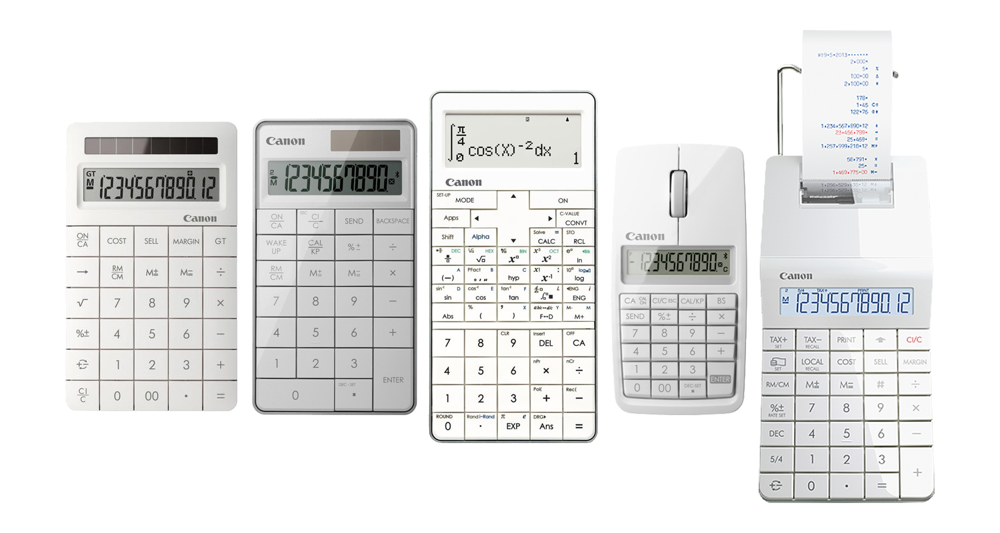
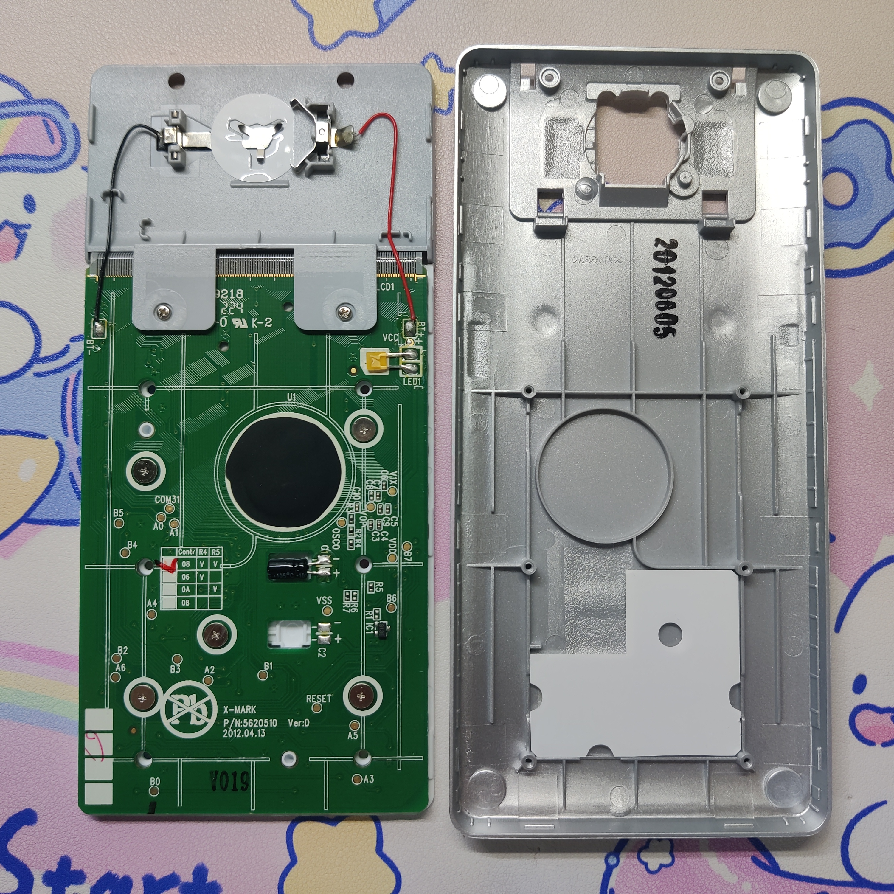

# **\[稀有型号\]Canon X Mark I Pro简评**

>若网页中图片无法正常显示，请检查当前网络环境能否正常访问GitHub。

演示公式镇楼

# 阅读须知

1. 除非另有声明，本文的文字、图片等均为本人创作及拍摄，未经许可不得以任何形式对本文的全部或部分内容进行转载、复制、改编、发布至其他平台等。
2. 文中的信息均基于发帖日期所能获取到的最新信息，当读者阅读时信息可能已有变化，一切均以最新消息为准。
3. 文中对计算器的描述等均属本人的主观感受，部分表述可能不够准确，若有疑惑欢迎指出。
4. 除非另有提及，否则文中出现的所有实际产品均为本人自费购买，本文不构成任何购买建议。
5. 本文章不对Canon的函数计算器是否是山寨盗版进行讨论，本人并不认可盗版行为也不提倡购买盗版商品。
> 注：部分阅读须知内容来自[喜羊羊第x代](https://tieba.baidu.com/home/main?id=tb.1.2062eec0.FwWcq4rwt0_gRZlb9o1EWA)

# 写在前面

提起Canon佳能的自然书写函数计算器，大部分人熟悉的应该只有F-718S系列、F-789SGA型号（部分地区为F-789SG）以及可由F-789SGA升级的F-792SGA型号（北美地区销售），即便贴吧内有人提起过，不过在看到镇楼图前，相信各位大概率是没见过这款计算器型号的。

我本人是几年前在一个外国计算器blog网站的banner图上见到这个型号（blog网址已丢失），被其外观吸引后，便在搜索引擎中进行了搜寻，作为一款2012年Canon推出的型号，其发售量并不大且早已停产，因此极难购得。在各种机缘巧合下，近期我得到了这款型号的计算器，且是箱说全，便写下了这一点点评测。

由于内部系统跟F-789SGA和F-792SGA大致一致，对于内部系统功能我不会花过多笔墨去介绍，有意详细了解可以去阅读贴吧内详细的系统评测介绍。

# 简要介绍

Canon X Mark I Pro，根据网络公开信息查询，于2012年跟F-789SGA一同上市销售。

该型号属于Canon的X Mark系列的产品，该系列下还有办公计算器(X Mark I)、键盘计算器(X Mark I Keypad)、鼠标计算器(X Mark I Mouse)以及打印机计算器(X Mark I Print)，该系列的产品都拥有这种简洁的外观设计语言。

> 图像来自Canon官网

Canon X Mark I Pro的系统功能介于F-789SGA和F-792SGA之间，应该是只比F-792SGA少了内置公式的功能和太阳能。

如果要用一句话总结这款机型的话：外观非常好看，适合收藏，只适合收藏。

如果各位有稍微了解设计的实用性的话，就会知道对于这种无缝隙全平的按键设计，其用户舒适度是极低的，事实也正是如此，一整个键盘输入体验就是一言难尽，具体后续会详细说明。

总之，如果你想收藏，这款型号是极好的；如果你想日常使用，并不推荐购买。

# 包装及外观

可以看出这台计算器是面向日本地区销售，据网络公开消息，这款计算器也面向欧美国家销售。

包装右上角是Canon的X Mark系列标志，左下角有标明“450 関数·機能”，右下角的贴纸标明该机型也是日本的“土地家屋調査士測量士”测试考试的允许机型，平成24年即2012年。

包装背面可以看到该计算器是中国生产。

打开包装，可以看到计算器本体以及本体上的塑料罩是通过一个U型的纸板垫高的，U型空间内放有其他附带物品。

包装盒内包含：计算器本体、塑料壳、用户说明书、计算器皮套。

说明书为日语英语双语种，均印刷在同一册内。

这款型号的计算器没有设计滑盖或者保护盖，而是附带了官方的保护皮套。

计算器本体的设计相对于其他函数计算器而言十分独特，虽然按键数量跟F-789SGA等型号一致，但经过了重新排布，中间部分的函数功能按键由6行增加为7行，由6列减少为5列，与下方主按键的列数对齐一致。

可以看到该计算器并没有太阳能供电板，正面也因此非常简洁。

从外观来说，这样的设计确实非常好看，但是具体的按键分布和使用感受如何后文会详细进行说明。

计算器本体背部正中央也是非常显眼的Canon的X Mark系列标志，整个背面中部平整，边缘弧形弯曲。计算器的各种信息均采用印刷，而不是F-789SGA等型号以及卡西欧函数计算器的注塑文字凸起。背部也标明了为中国生产。

电池仓盖为滑槽设计，可以看到整个计算器的正面和背面不存在螺丝，四个垫片也只是垫片，后方不存在螺丝。

出厂自带电池绝缘片，由于该计算器不存在太阳能供电，因此将电池绝缘片抽出后方可正常使用。

计算器本体重量为112.6g。

作为对比，F-789SGA的本体重量为97.3g。

扣上滑盖后，F-789SGA的重量来到了138.4g。

# 系统功能

内部系统功能跟F-789SGA和F-792SGA大致一致，且这篇评测的重点不在此，因此仅稍作提及。具体详细还请阅读贴吧内其他人发的F-789SGA或者F-792SGA评测贴。

Canon X Mark I Pro跟F-792SGA一样，拥有10个模式（右侧F-789SGA已硬改电阻升级至F-792SGA）。

顺便可以看到，Canon X Mark I Pro使用的是黑色的LCD液晶屏幕，屏幕背景并没有F-789SGA等型号的偏绿，液晶屏的观感显然更高级。

## 向量(VCTR)

可定义4个向量变量。

")

## 方程(EQN)

支持四元联立方程组和四次方程的求解。

## 矩阵(MATX)

可定义4个矩阵变量。

每个矩阵变量最大支持4×4的维数。

## 变量

除开A~F、X、Y、M共9个变量外，0~9也可定义为变量调取使用，通过\[RCL\]+\[0\]~\[9\]调取0~9变量，可以看到数字0~9下方均多了下划线以表示此为变量。

## 单位转换、科学常数

可通过\[CONVT\]调出单位转换菜单界面。

通过\[Shift\]+\[CONVT\](C-VALUE)调出科学常数菜单界面。

具有79个科学常数和170个转换对。

## [不具备]内置函数(FMLA)功能

F-792SGA可通过\[Alpha\]+\[(\](FMLA)调出内置函数功能界面。

")

> 图像来自：[Canon Canada Inc.,](https://www.canon.ca/en/product?name=F-792SGA)

# 精度

内部精度为20位。

# 按键分布、外观

可以看到虽然按键进行了重新分布，但其实也只是位置进行了更改，每个按键对应的第二功能和第三功能都没有变化。

按键分布最明显的几个变化：MODE键置于最左上角，Shift键和Alpha键下移至第三行，RCL键提升至第三行右侧，积分∫键下移至第六行。

第二功能和第三功能都印刷到了按键上，按键之间的间隙极小，整个计算器本体正面非常平整，中部分的函数功能按键减少列数增加行数，使得整个键盘对齐。

方向键使用了十字键(D-Pad)的设计，虽然正常输入不影响，但是没法做到四个方向键各自独立按下。

外观来说确实更加好看了，但是按键手感只能用灾难来形容，由于没了按键空隙，对于按键的定位变得不容易，输入时必须要看着键盘，一不小心还容易按到旁边的按键。

对于按键的手感我将在后文拆机环节介绍，拆机后更容易理解情况。

# 拆机、按键手感

向上滑出电池盖，此处有三颗螺丝，电池左下角的螺丝仅用于固定纽扣电池盖和后盖，拧下后先将纽扣电池取下。

拧下上方的两枚螺丝，计算器前面板依然无法取下。由于计算器不可能只靠卡扣和上方两枚螺丝就能固定牢固，因此肯定有更多的螺丝在内部。

回到正面，此时可用塑料片将屏幕四周的卡扣划开，屏幕的塑料罩得以取下。

此时各位可能也意识到了，并不像F-789SGA以及卡西欧等机型的计算器，这款型号的按键是从正面取出的。

在对键盘布局拍照备用后，小心将按键全部撬出。

可以看到除开方向键外，其他的全部按键都跟F-789SGA以及卡西欧等机型的计算器一样采用了薄膜键盘，虽然实际键程基本无差别，但是由于按键的面积更大，体感上的键程要比F-789SGA以及卡西欧等机型短很多。

但是，F-789SGA以及卡西欧等机型的计算器的按键主要部分均位于外壳内部，通过正面板的孔突出外壳，按键可接触按下的部分正好是通过正面板的孔限制住方向的大小。

相对的，Canon X Mark I Pro这款计算器的按键是通过按键后方的塑料卡扣固定在PCB电路板和按键之间的一层塑料板上，塑料板限制住的大小比按键可接触的大小要更小，这导致如果按键按下时不是在正中心或者施力的方向不对，按键会向四个方向倾斜，而不会真正按下。

只有按在正中心且垂直按键才能使PCB电路板识别到键入动作，再加上前文提到的按键间空隙极小导致的不方便定位和键程短，整个的输入体验极其糟糕。

将圆形的小垫片揭开，在其后方露出了6枚螺丝，这便是最关键的固定螺丝。

将螺丝拧下，塑料板和PCB板依然在一起，但是与后壳已经分离开了。

可以看到后壳内有油墨喷印`20120605`，后壳下方为金属配重片。

PCB上跟F-789SGA等型号一样有LED元件，猜测是用于稳压，不过在计算运行时会有微弱发光。PCB上有一个表格，列出了型号08、06、0A对应的电阻R4和R5的连通情况。 目测可以改变电阻存在情况更改型号，但是由于Canon这个系列的科学函数计算器对外公布的仅存在这一款型号，且这台计算器来之不易，实在是不敢去破坏，就不折腾了。

将PCB上的5枚平头螺丝拧下，塑料板、薄膜、PCB分离。

可以看到方向键使用的按键并不是其他按键的薄膜键盘，这四个按键键感跟单片机上通用使用的按键(SW)非常类似，较为清脆，键程极短。

屏幕跟后方的塑料保护板应该是相互粘住，将塑料保护板与PCB之间的两枚螺丝拧下后依然无法将塑料保护板分离。

被屏幕塑料罩遮挡住的部分的左上角在对光时能看到`VD96506A`的字样。

# Fin.

评测到此结束。

还是那句话：外观非常好看，适合收藏，只适合收藏。

这套设计语言还是非常好看的，但如果你是想日常使用的话，并不推荐去购买，更何况目前也基本买不到。

最后放上张目前我认为设计最好看的两款自然书写科学函数计算器当结束图。

